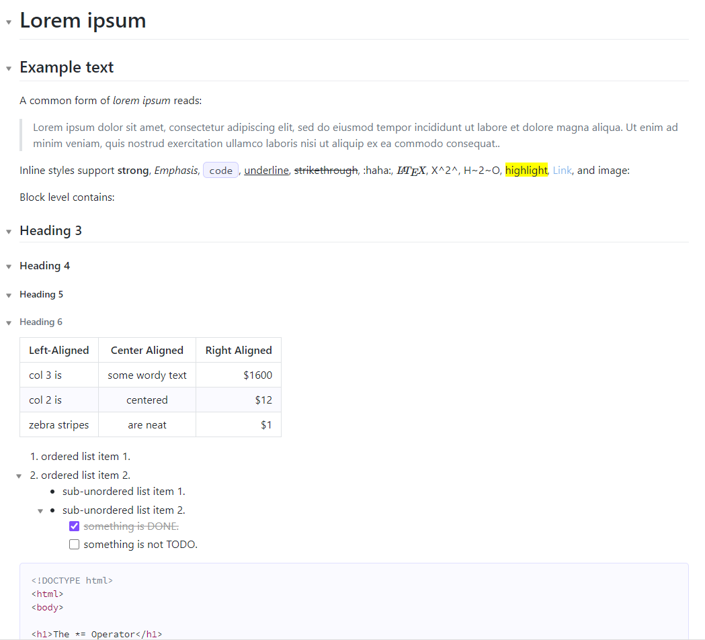

# GitBlue Theme for Obsidian
This theme is based on the github style, just with a blue-ish touch

## Screenshot

## Installation

Copy the  `GitBlue` folder to the folder `.obsidian\themes` of your vault
